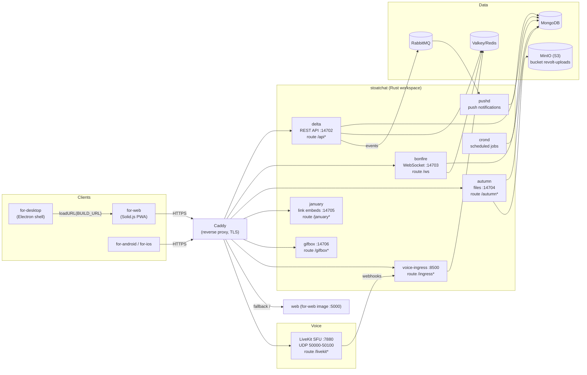
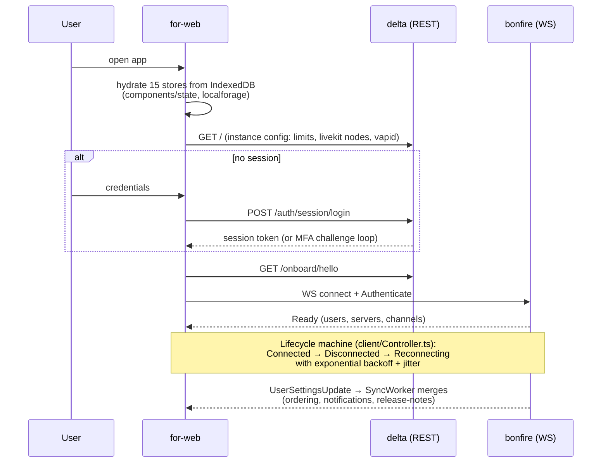
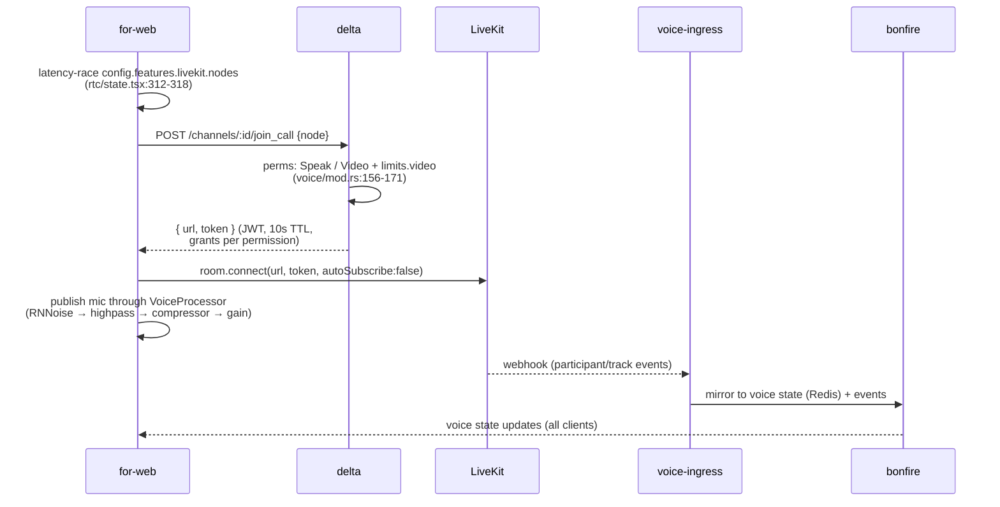
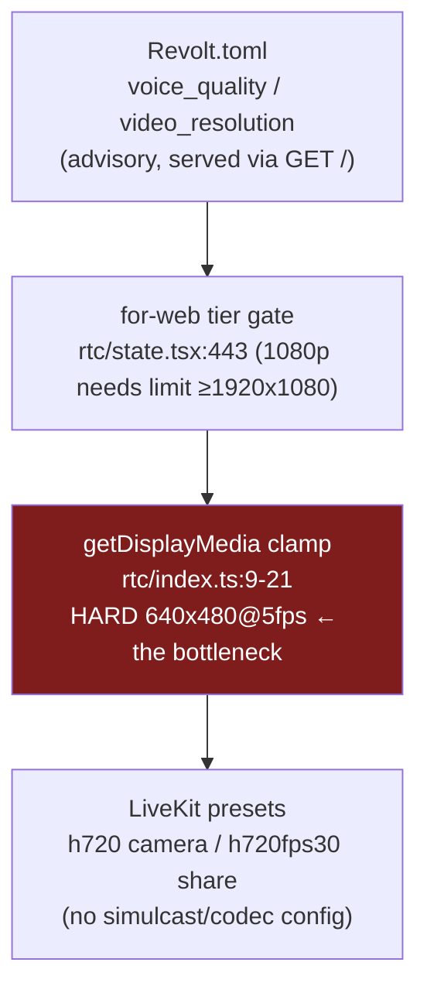
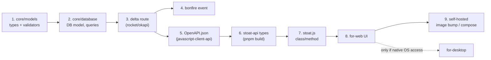

# How Stoat Works — Architecture & Flows

> Source: full-source mapping of the five repos in this workspace (2026-08-27). File references are exact.

## 1. Service topology

Everything sits behind Caddy on one domain. Every backend service is Rust, shares one MongoDB, and reads the **same** `Revolt.toml` (bind-mounted by `self-hosted/compose.yml`).



Key facts:
- **delta** serves `GET /` with the instance config — hosts, LiveKit nodes, VAPID key, and **all limits** (`stoatchat/crates/delta/src/routes/root.rs:136-152`). Clients drive every quota from this payload.
- **bonfire** is event fan-out only; it serves no config.
- Instance discovery for third-party clients: `https://<host>/.well-known/stoat` → `{"api": "..."}` (served as static `stoat.json` by Caddy).

## 2. Client boot & session lifecycle



## 3. Sending a message (with attachment)

```mermaid
sequenceDiagram
    participant C as for-web
    participant A as autumn
    participant D as delta
    participant B as bonfire
    participant P as pushd

    C->>C: Draft store: outbox entry,<br/>idempotency key (ulid)
    C->>A: POST /attachments (XHR, progress)
    A->>A: size vs limits.file_upload_size_limit<br/>+ body_limit_size (api.rs:52-57, 205-214)
    A-->>C: file id (cached; retry won't re-upload)
    C->>D: POST /channels/:id/messages<br/>(stoat.js Channel.sendMessage)
    D->>D: validate: message_length,<br/>attachments ≤ N, replies, embeds<br/>(messages/model.rs)
    D-->>B: event publish
    B-->>C: Message event (all clients)
    D-->>P: via RabbitMQ → web push (VAPID)
    Note over D: january fetches link embeds async<br/>(process_embeds.rs, max message_embeds)
```

## 4. Joining a voice call



Quality chain (who caps what):


## 5. How a new feature crosses the stack


