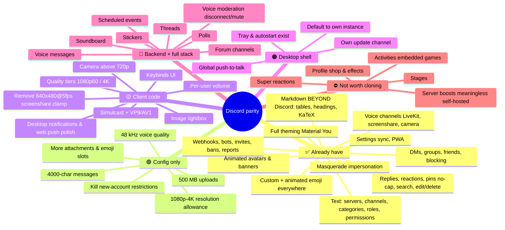
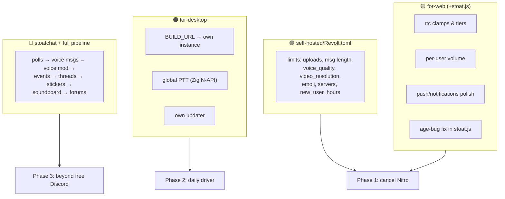

# Discord-Like Features — Status Map

> What Discord (free + Nitro) offers vs. what this stack has, organized by what it takes to close each gap.
> Exact file/line targets live in [../NITRO-PARITY-MAP.md](../NITRO-PARITY-MAP.md); this doc is the presentational view.

## The whole picture

## Nitro perks specifically

| Nitro sells | Here | Path |
|---|---|---|
| 500 MB uploads | 🟢 | `REVOLT__FEATURES__LIMITS__*` env overrides + restart |
| 4000-char messages | 🟢 | same |
| HD (1080p60/4K) streaming | 🟡 | the one perk locked in *code*: client clamps (see map §2.1) |
| Animated avatar/banner | ✅ | free, ungated |
| Emoji anywhere / animated | ✅ | free, ungated |
| Custom profiles | ✅ mostly | banner+bio exist; accent colors optional cosmetic work |
| Custom themes | ✅ better | full theming vs Discord's paid palettes |
| Server boosts | N/A | everything already unlocked |
| Super reactions, shop | ⛔ | cosmetic monetization, skip |

**Conclusion the numbers support:** with one config change-set and one client patch (streaming quality), every *utility* Nitro perk is covered. The 🔴 tier is about matching free Discord's breadth, not Nitro.

## Feature-by-feature ownership

## Current client feature matrix (upstream-tracked)

From `for-web/doc/src/feature-matrix.md`: **160 ✅ / 8 🚧 / 12 ❌** for this client. The ❌/🚧 that overlap this plan: desktop notifications (P0), update indicator (P0), member list, GIF picker, voice UX (volume/hide/ignore), voice moderation, desktop app items. Everything else in the matrix is done.
