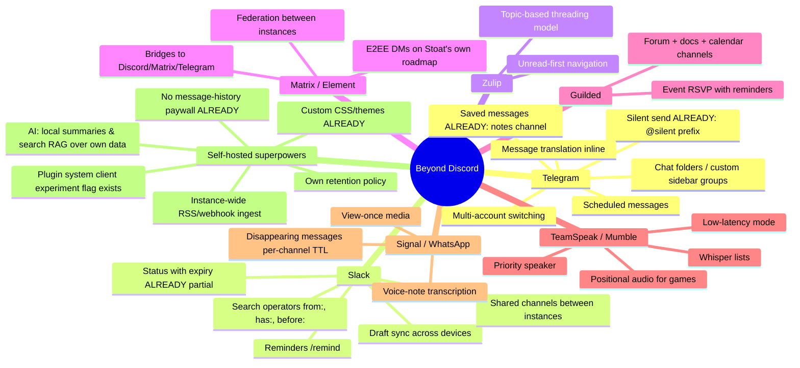
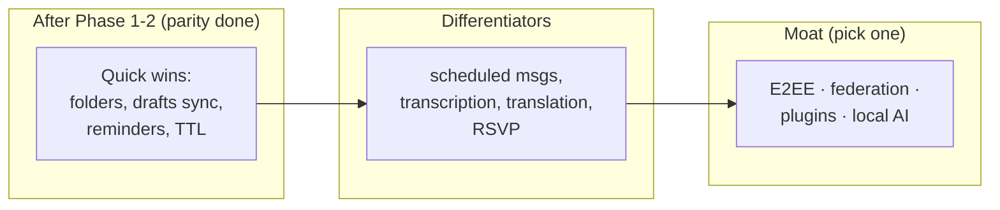

# Beyond Discord — Features Discord Doesn't Have

> Ideas harvested from other chat/community apps, mapped onto this stack. Goal: after parity, make the instance *better* than Discord, not just equal.
> Repo legend: 🟢 config · 🟡 for-web/stoat.js · 🟠 for-desktop · 🔴 stoatchat (+ full pipeline) · Effort: S/M/L/XL.

## Idea map by source app

## Mapped and ranked

### Quick wins (S–M, mostly 🟡 client or 🟢 config)

| Feature | From | Where it lands | Notes |
|---|---|---|---|
| Chat folders / sidebar groups | Telegram | 🟡 `state/stores/Ordering.ts` + server sidebar | Pure client state; syncs via existing settings-sync (`Sync.ts` STORE_KEYS) |
| Search operators | Slack | 🟡 + small 🔴 | Delta already has message search; extend query parsing |
| Draft sync across devices | Slack | 🟡 | `Draft.ts` is local-only today; piggyback settings sync |
| Reminders (`/remind`) | Slack | 🔴 S | crond daemon already exists for scheduled jobs |
| Per-channel message TTL | Signal | 🔴 S-M | Channel field + crond sweep; a privacy feature Discord will never ship |
| Status with expiry | Slack | 🟡 + 🔴 S | Status text exists (128 chars); add expiry timestamp |

### Medium (M–L)

| Feature | From | Where | Notes |
|---|---|---|---|
| Scheduled messages | Telegram | 🔴 M | Outbox already has idempotency keys (`Draft.ts`); add `send_at` + crond |
| Voice-note transcription | WhatsApp | 🔴 M | Companion service (Whisper local) writing text alongside audio attachment — pairs with the voice-messages feature (parity map Part 4) |
| Inline translation | Telegram | 🟡 M | Client-side call to self-hosted LibreTranslate; zero backend change |
| Topic threading (Zulip-style) | Zulip | 🔴 L | Lighter alternative to full Discord threads — consider *instead of* threads |
| Priority speaker / whisper | TeamSpeak | 🟡 M + 🔴 S | LiveKit track permissions + audio ducking client-side |
| Event RSVP + calendar channel | Guilded | 🔴 M | Same model as scheduled events (parity map Part 4 item 5), plus ICS export |

### Big bets (L–XL) — pick at most one at a time

| Feature | From | Where | Notes |
|---|---|---|---|
| E2EE DMs | Matrix/Signal | 🔴 XL | On Stoat's own long-term roadmap; use a mature lib (vodozemac/libsignal), never hand-rolled |
| Federation / shared channels | Matrix, Slack Connect | 🔴 XL | Multi-instance client support is already half-built in for-web (`components/instance/`, currently gated off) — that's the client half |
| Bridges (Discord/Matrix/Telegram) | Matrix | separate service | Was on old Revolt roadmap; run as bot-style sidecar, no core changes |
| Plugin system | — | 🟡 L | `plugins` experiment flag already registered in `Experiments.ts` as placeholder; a client plugin API would leapfrog Discord permanently |
| Local AI: channel summaries, semantic search | — | sidecar M-L | RAG over own MongoDB history; self-hosted = no privacy tradeoff. Natural Zig/Rust sidecar behind Caddy |
| Positional audio | Mumble | 🟡 L | LiveKit spatial audio + game telemetry; niche |

## Where these sit in the pipeline

**Recommendation:** after parity Phases 1–2, do the Telegram/Slack quick wins first (folders + drafts sync + reminders) — they are daily-visible and cheap — then choose **one** moat feature. Plugins is the strongest: it converts every future feature request into community work, and the hook (`Experiments.ts` `plugins` flag) already exists.
