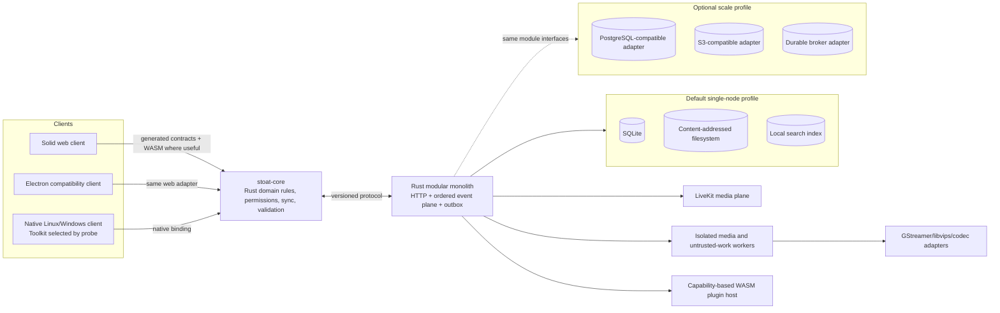

# Complete Refactor Decision

Decision date: 2026-08-27. This document supersedes architectural commitments in docs 05–07 where they conflict with the primary-source corrections in [08-refactor-technology-research.md](./08-refactor-technology-research.md).

## Product boundary

Stoat is a user-controlled, extensible communication platform that remains reliable offline and on constrained self-hosted hardware. It is not a bundle of every feature from Discord, Matrix, Slack, Twitch, and Notion.

Voice, video, screen sharing, rich conversation, local search, plugins, captions, and focused collaborative artifacts fit this boundary. Federation, broadcasting, generalized collaborative state, semantic models, and end-to-end encryption remain experiments until a concrete workflow, threat model, benchmark, and operational owner exist.

## End-state architecture

### Decisions

| Area | Decision | Explicit non-decision |
|---|---|---|
| Product | Local-first, self-hostable, extensible communication | Do not become a generic collaboration suite |
| Web UI | Keep Solid and the accessible HTML text surface | No framework or canvas rewrite |
| Desktop baseline | Keep Electron until a replacement clears every gate | Tauri is not categorically rejected; it must pass distro probes |
| Native target | Run a fixed Flutter, Qt/QML, Slint, and credible Rust-toolkit probe; select one winner from evidence | Do not select from reputation or estimated RSS |
| Shared core | Rust deep modules for canonical types, validation, permissions, deterministic sync, cache semantics, and pure message normalization | No shared reactive store, rendering abstraction, or windowing layer |
| Server | Rust modular monolith for API and event plane; isolate media and hazardous workers | No big-bang service collapse |
| Default data profile | Intend SQLite + filesystem + local search after conformance, recovery, and load gates | “SQLite everywhere” is not an accepted premise |
| Scale profile | Preserve PostgreSQL-compatible, S3-compatible, and durable-broker adapters behind real seams | Do not maintain arbitrary duplicate implementations without users |
| Media | Keep LiveKit; evaluate GStreamer for capture, transcode, recording, and hardware acceleration | Do not replace the SFU or promise codec gains without benchmarks |
| Extensibility | WASM Components with a narrow, versioned, capability-based host interface | No ambient filesystem/network/message access |
| E2EE | Treat LiveKit media/data E2EE and selective MLS rooms as separate, threat-modeled products | Do not equate trusted-agent E2EE with zero knowledge |
| Frontier work | Prioritize local search, captions, and focused collaborative documents | MoQ, federation, broad CRDTs, embeddings, and MLS stay experimental |

## Canonical domain and sync contract

The first permanent seam is the domain and event interface. It owns:

- Canonical entities: account, device, session, space, channel, membership, role, message, attachment, reaction, call, stream, document, plugin installation, cursor, and audit record.
- Stable identifiers, schema versions, permission rules, retention state, and deletion state.
- A versioned event envelope with event ID, entity ID, actor, device, server order, optional causal predecessor, schema version, idempotency key, and payload.
- Cursor-based replay, duplicate suppression, gap detection, tombstones, bounded retention, snapshot recovery, and permission-revocation propagation.
- Server authority for membership, authorization, moderation, and accepted writes. Local-first never means offline authorization.
- Compatibility behavior for unknown fields and unknown events during staggered upgrades.

This module must be deep: callers learn one small protocol interface while ordering, replay, conflict, revocation, migration, and validation remain local to its implementation.

## Security and operational model

Before persistence or client replacement, specify:

1. Per-device revocable credentials, account recovery, device loss, session invalidation, and administrator recovery.
2. Plugin signing, trust roots, install consent, capability grants, quotas, deadlines, revocation, audit trails, ABI versions, and rollback.
3. Encryption modes: server-readable, trusted-agent E2EE, and zero-knowledge. Each mode declares which search, moderation, captions, recording, notification previews, and recovery features remain possible.
4. Deletion propagation through local caches, search indexes, blobs, derivatives, backups, transcripts, exports, and plugin outputs.
5. Content-redacted telemetry, health checks, convergence diagnostics, rate limits, incident response, and security patch ownership.

## Native toolkit probe

Build the same thin vertical slice in each viable toolkit: authentication, channel list, 1,000-message virtualized history, composer with IME, screen-reader navigation, one LiveKit call, screen sharing, tray notification, offline cache, and crash recovery.

The fixed matrix is:

- Linux Wayland and X11; Windows 11.
- NVDA and Narrator on Windows; Orca on Linux.
- Keyboard-only navigation, IME, bidirectional text, selection, scaling, high DPI, and rich message semantics.
- GPU-enabled and GPU-disabled/software-render paths.
- Camera, microphone, device switching, screen sharing, reconnection, and degraded networks.
- Startup, p95 interaction latency, memory, CPU during calls, package size, updater behavior, crash recovery, and maintainability.

Flutter's official LiveKit support makes it a credible probe candidate. Qt/QML and Slint remain credible because accessibility, platform integration, and rendering fallback matter. Electron remains the baseline to beat. No toolkit wins until the same artifact and workload pass on the same hardware.

## Migration sequence

### Now: make the baseline trustworthy

Fix production devtools, floating-element/listener leaks, RxJS cleanup, O(k²) hydration, unbounded stores, unordered bulk events, message virtualization, and Markdown caching. Add reproducible baseline workloads before claiming gains.

### Next: create the permanent seam

Specify the domain model, event envelope, sync state machine, identity/recovery model, compatibility policy, and deterministic conformance suite. Extract only pure invariants into `stoat-core`; keep Solid reactivity in Solid.

### Then: migrate bounded vertical slices

Introduce the outbox and replay protocol. Add a replaceable durable client cache. Migrate messages, membership, attachments, and calls one slice at a time. Build SQLite/filesystem adapters alongside incumbents and compare identical conformance, load, corruption, migration, backup, and restore tests.

### Later: replace platforms and expand capability

Select the native toolkit from the probe. Build the native client against stable contracts. Introduce the constrained WASM host, local search, captions, and one focused collaborative-document workflow. Promote experiments only when their gates pass.

## Deletion gates

A legacy path may be deleted only when all applicable conditions hold:

- The replacement passes contract, property, fuzz, failure-injection, migration, backup/restore, and load tests.
- Storage meets declared RPO/RTO, retention, deletion, and rollback requirements.
- A client passes accessibility, IME, platform, media, offline, crash, and upgrade probes.
- Two stable releases run the replacement with production telemetry and a tested rollback.
- Unknown-version compatibility and downgrade behavior are verified.
- One named module owner accepts patching, incident response, support, and deprecation responsibility.

## First runnable gate

Implement a deterministic offline/reconnect simulation against the current stack. It must cover duplicate delivery, event gaps, reordered delivery, tombstones, permission revocation, device loss, stale offline writes, snapshot recovery, and eventual convergence. This is the first task because every database, native client, plugin interface, encryption mode, and frontier protocol depends on the same domain and sync semantics.
